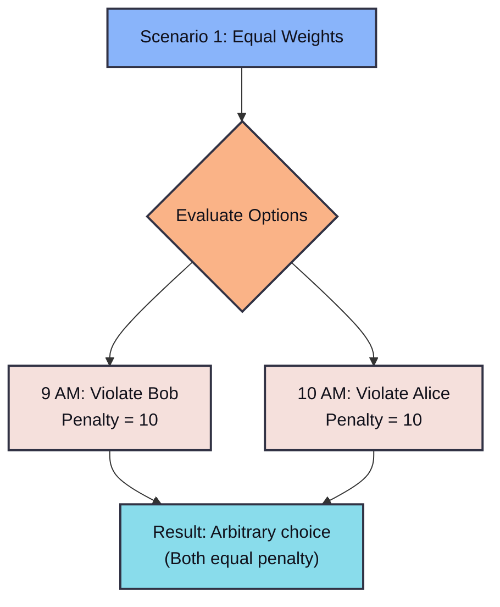
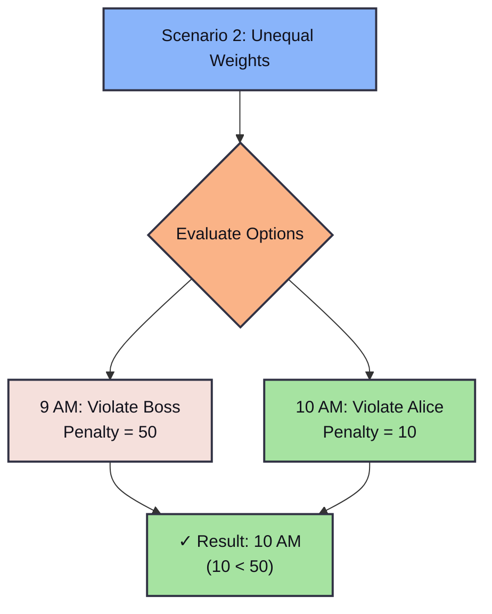
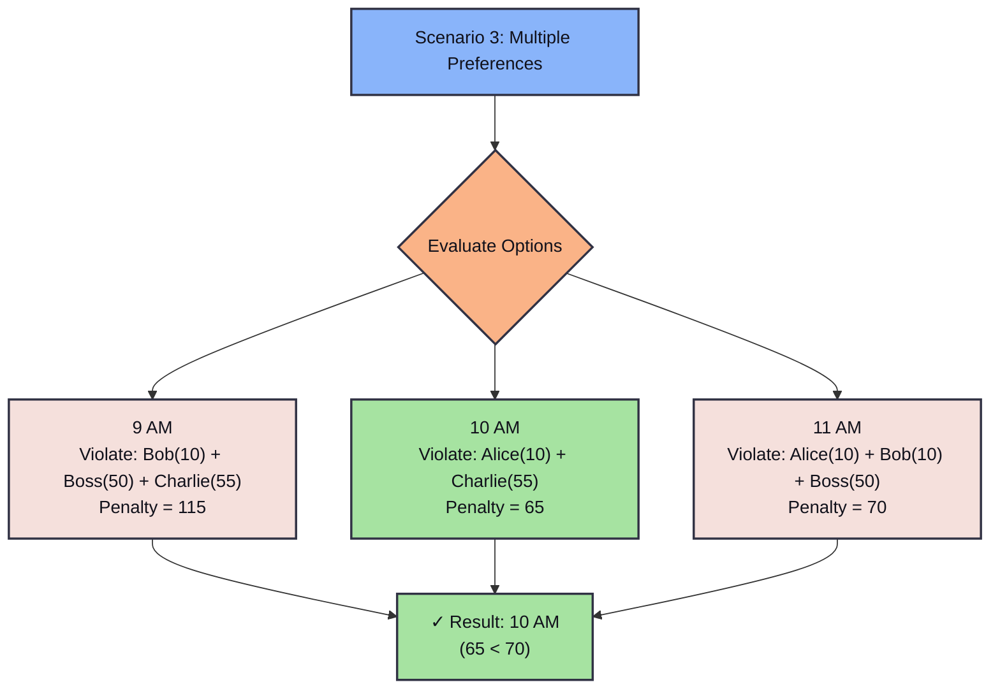

# The Optimizer

In this part, we explore the `Optimize` struct, which extends the capabilities of the standard `Solver`. While a `Solver` asks "Is there *any* solution?", an `Optimizer` asks "What is the *best* solution?".

## Key Concepts

1.  **Objectives (`minimize`, `maximize`):
    *   Instead of just satisfying constraints, you can tell Z3 to find a model that minimizes or maximizes the value of an arithmetic expression.
    *   Example: `opt.minimize(&(&x + &y))` tries to make the sum $x+y$ as small as possible.

2.  **Hard Constraints (`assert`):
    *   These work exactly like in the standard `Solver`. They *must* be true for any solution.
    *   If a hard constraint cannot be satisfied, the result is `Unsat`.

3.  **Soft Constraints (`assert_soft`):
    *   These are optional. The optimizer tries to satisfy as many as possible.
    *   You can assign **weights** to soft constraints. Z3 will minimize the sum of weights of *unsatisfied* soft constraints.
    *   This is useful for problems where perfect solutions might not exist, or where you want to express preferences.
    *   **Important:** Soft constraints with the **same group ID** have their penalties summed together as a single objective. Soft constraints with **different group IDs** are treated as separate objectives and optimized lexicographically (first objective, then second, etc.). To get weighted preference behavior, use the same group ID for all related soft constraints.

## Code Walkthrough

We have implemented three examples in `src/main.rs`.

### Example 1: The Knapsack Problem

**Goal:** You have a backpack with weight limit 15. You want to choose items to maximize value without exceeding the weight.

*   Item A: Value 4, Weight 12
*   Item B: Value 2, Weight 2
*   Item C: Value 2, Weight 1
*   Item D: Value 1, Weight 1
*   Item E: Value 10, Weight 4

**Logic:**
1.  Define boolean variables for each item (Taken / Not Taken).
2.  Constraint: Total Weight <= 15.
3.  Objective: Maximize Total Value.

### Example 2: Advent of Code Day 10 Part 2 (Factory)

**Goal:** Minimize the total number of button presses required to set machine counters to specific target values.

**Problem:**
*   Each machine has several counters (initially 0).
*   Buttons increment specific counters by 1.
*   We need to reach specific target values for each counter.
*   We want to minimize $\sum (\text{presses for each button})$.

**Logic:**
1.  For each button on a machine, define an integer variable `p_i` (number of presses).
2.  Constraint: `p_i >= 0`.
3.  For each counter `c_j`, the sum of presses for all buttons affecting `c_j` must equal the target value for `c_j`.
4.  Objective: Minimize $\sum p_i$.

### Example 3: Soft Constraints (Meeting Scheduling)

**Goal:** Schedule a meeting time considering participant preferences with different priorities.

**Scenarios:**
1.  **Equal Weights:** Alice prefers 9 AM (Weight 10) vs Bob prefers 10 AM (Weight 10)
    *   With equal weights, violating either person costs 10. Z3 picks arbitrarily.
    
2.  **Unequal Weights:** Alice prefers 9 AM (Weight 10) vs Boss prefers 10 AM (Weight 50)
    *   Choosing 9 AM: violate Boss = 50 penalty
    *   Choosing 10 AM: violate Alice = 10 penalty
    *   Z3 chooses 10 AM to minimize penalty (10 < 50)

3.  **Multiple Preferences:** Alice (9 AM, weight 10), Bob (10 AM, weight 10), Charlie (11 AM, weight 55) , plus Boss (10 AM, weight 50)
    *   Choosing 9 AM: violate Bob + Boss + Charlie = 10 + 50 + 55 = 115 penalty
    *   Choosing 10 AM: violate Alice + Charlie = 10 + 55 = 65 penalty
    *   Choosing 11 AM: violate Alice + Bob + Boss = 10 + 10 + 50 = 70 penalty
    *   Z3 chooses 10 AM to minimize total penalty (20 < 70)

**Key Insight:** All soft constraints use the **same group ID** (`"preferences"`), which tells Z3 to sum their penalties into a single objective. Without a common group ID, Z3 would treat each as a separate objective and optimize lexicographically instead of minimizing the total penalty.

## Soft Constraints Visualization

### Scenario 1: Equal Weights



### Scenario 2: Unequal Weights



### Scenario 3: Multiple Preferences


## Running the Code

```bash
cargo run -p part_03_optimizer
```

## Homework: Production Planning

**Goal:** Maximize profit with resource constraints.

**Scenario:**
Your factory produces two products: **Chairs** and **Tables**.

*   **Chairs:**
    *   Sell for **$20**.
    *   Require **1 hour** of carpentry.
    *   Require **3 hours** of painting.
*   **Tables:**
    *   Sell for **$50**.
    *   Require **4 hours** of carpentry.
    *   Require **1 hour** of painting.

**Resources Available:**
*   Carpentry: **40 hours** max per week.
*   Painting: **40 hours** max per week.

**Task:**
Determine the optimal number of Chairs and Tables to produce to **maximize revenue**.

**Hints:**
*   Use `Optimize::new()`.
*   Variables `c` (chairs) and `t` (tables) must be >= 0.
*   Add constraints for total carpentry time and total painting time.
*   Maximize `20*c + 50*t`.

## Further Reading

*   **Knapsack Problem:** [https://en.wikipedia.org/wiki/Knapsack_problem](https://en.wikipedia.org/wiki/Knapsack_problem)
*   **Mathematical Optimization:** [https://en.wikipedia.org/wiki/Mathematical_optimization](https://en.wikipedia.org/wiki/Mathematical_optimization)


