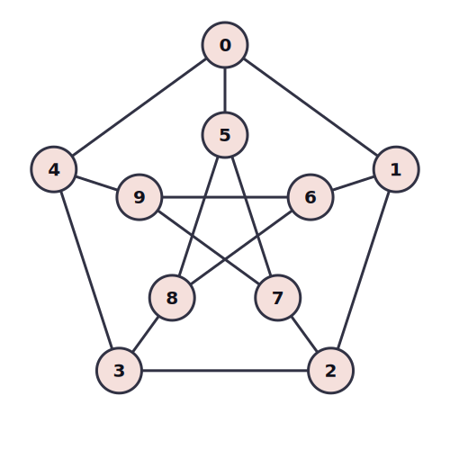

# Incremental Solving

In this part, we explore the **Incremental Solving** capabilities of Z3 using `push()` and `pop()`. 

Standard solving involves defining a problem, checking it, and finishing. Incremental solving allows you to **modify** the solver's state and ask multiple questions efficiently without rebuilding the entire context from scratch.

## Key Concepts

1.  **Scopes (`push` & `pop`):**
    *   `solver.push()`: Creates a new "scope" or "checkpoint". Any assertions added after this can be undone.
    *   `solver.pop(n)`: Removes the last `n` scopes, discarding all assertions and state changes made within them.

2.  **Incremental Performance:**
    *   Z3 retains learned clauses and heuristics from the base level.
    *   Solving `Constraint A + Constraint B`, popping B, then solving `Constraint A + Constraint C` is much faster than starting over, because Z3 already "understands" Constraint A.

3.  **Use Cases:**
    *   **Speculative Execution:** "What if I make this choice? Is it solvable? If not, undo."
    *   **Interactive Tools:** Checking validity of user moves in a game or configuration tool.
    *   **Manual Backtracking:** Implementing your own search algorithms on top of Z3.

## Code Walkthrough

We have implemented two separate programs in `src/bin`.

### Example 1: Basic Scopes (`src/bin/basic_scopes.rs`)
**Goal:** Demonstrate how `push` and `pop` isolate constraints while preserving the base AST.

**Logic:**
1.  **Base Layer:** Define `z == x + y` and `x > 0, y > 0`.
    *   This logic persists throughout all future scopes.
2.  **Scope 1:** `push()` -> Assert `z == 10`.
    *   Solver finds valid inputs (e.g., `x=5, y=5`).
3.  **Reset:** `pop()` -> Removes `z == 10`.
4.  **Scope 2:** `push()` -> Assert `x == 20, y == 30`.
    *   Solver infers `z == 50` from the base rule.
5.  **Reset:** `pop()` -> Removes specific inputs.
6.  **Scope 3:** `push()` -> Assert `z == 5` AND `x > 10`.
    *   **UNSAT**: Base rule `x > 0` and `y > 0` implies `z` must be at least `x+1`. If `x > 10`, then `z > 11`, which contradicts `z == 5`.

### Example 2: Interactive Shidoku (TUI)
**Goal:** A terminal-based interface for solving a 4x4 Sudoku (Shidoku) puzzle.

**Why Push/Pop?**
This application demonstrates the power of incremental solving for interactive applications.
*   **Move History:** Every time you place a number, the application calls `solver.push()`. This saves the entire state of the solver (including all previous constraints).
*   **Instant Undo:** When you press Backspace, the application calls `solver.pop(1)`. This instantly removes the last constraint added, reverting the solver to its exact previous state.
*   **Validation:** After every move, the solver checks if the puzzle is still solvable (`Sat`). If you make a move that leads to a conflict, the state becomes `Unsat`, and the UI alerts you immediately. You can then simply `pop` (Undo) to fix it.

**Running the App:**
```bash
cargo run -p part_04_push_pop --bin sudoku
```
*   **Arrows/HJKL:** Move cursor.
*   **1-4:** Place a number.
*   **Backspace:** Undo the last move (Pop state).
*   **Q:** Quit.

## Running the Code

To run the basic scopes example:
```bash
cargo run -p part_04_push_pop --bin basic_scopes
```

To run the interactive Sudoku assistant:
```bash
cargo run -p part_04_push_pop --bin sudoku
```

## Homework: Map Coloring with Backtracking

**Goal:** Implement a solver for a graph coloring problem, leveraging `push` and `pop` for efficient backtracking to find a complete solution.

**Scenario:**
You have a complex map with **10 regions** (Nodes 0-9) connected in the structure of a **Petersen Graph**.



*   **Outer Cycle:** 0-1, 1-2, 2-3, 3-4, 4-0
*   **Inner Star:** 5-7, 7-9, 9-6, 6-8, 8-5
*   **Spokes:** 0-5, 1-6, 2-7, 3-8, 4-9

**Task:**
1.  Define integer variables for each of the 10 regions representing its color (1, 2, or 3).
2.  Add constraints ensuring that connected regions have different colors.
3.  Implement a search strategy using `push()` and `pop()` to find a valid 3-coloring.
    *   Iterate region by region (0 to 9).
    *   Try a color.
    *   If valid (SAT), recurse to the next region.
    *   If invalid (UNSAT), backtrack (POP) and try the next color.

**Hints:**
*   Store your variables in a `Vec<Int>`.
*   Define edges as a list of pairs `(u, v)` and iterate over them to add `u != v` constraints.
*   The backtracking loop is the core of this exercise.

## Further Reading

*   [Satisfiability Modulo Theories (SMT)](https://en.wikipedia.org/wiki/Satisfiability_modulo_theories)
*   [Petersen Graph on Wikipedia](https://en.wikipedia.org/wiki/Petersen_graph)
